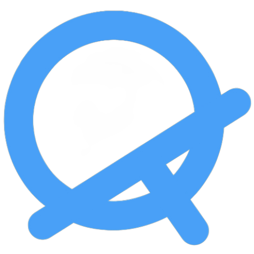
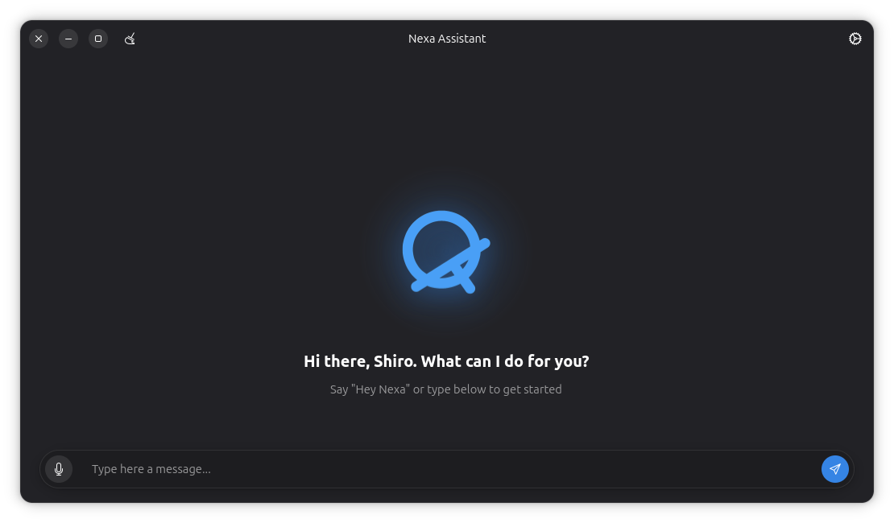
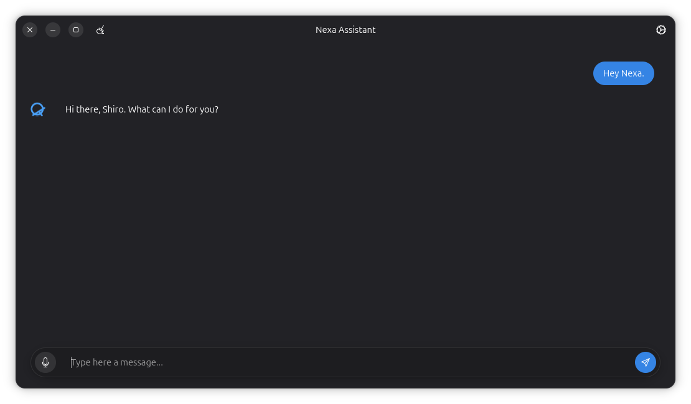
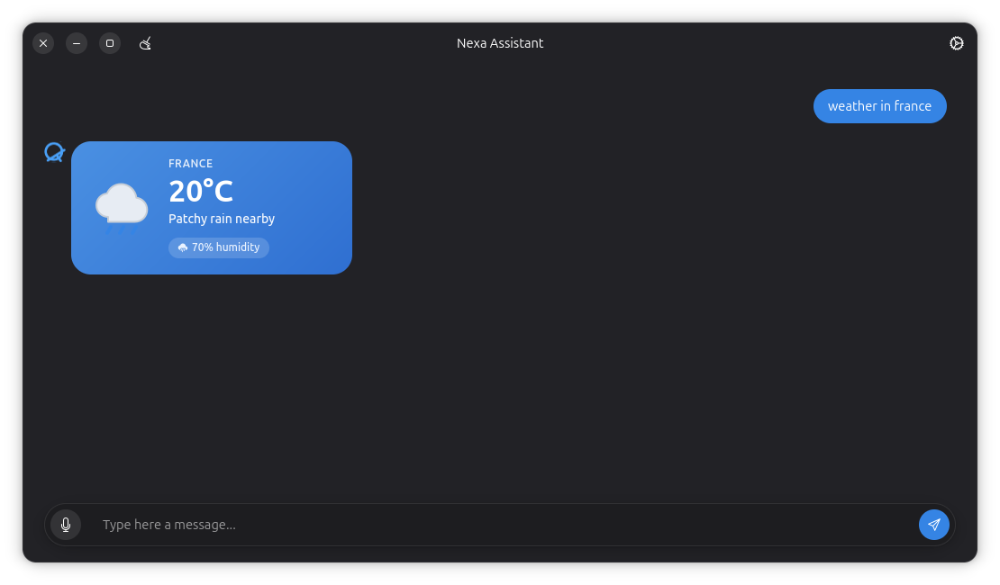

<p align="center">
  
</p>

<h1 align="center">Nexa Assistant</h1>

<p align="center">
  A local-first, privacy-focused voice assistant for Linux — built with GTK4 &amp; Adwaita.
</p>

---

## The story

In 2025 the idea just wouldn't leave me alone. I didn't really have anyone
around to talk it through with, so I ended up hashing it out with ChatGPT
instead. At some point the name "Nexa" popped into my head, and it stuck.

The logo happened almost by accident — I opened FlipaClip on my phone one
day and just started drawing random lines, and that turned into what you
see today.

In the summer of 2026, right after finishing the school year, I started
actually building Nexa. No wifi at home at the time, so it was all done
completely offline. Eventually my parents heard about the project and
decided to get a router installed.

Now summer's almost over and school's about to start again, so it felt
like the right moment to open this up, share what I've built so far, and
see what people think Nexa should become next.

## What is Nexa?

Nexa is a voice assistant that runs entirely on your machine. Wake-word
detection, speech-to-text, and text-to-speech all happen locally —
nothing is sent to the cloud.

- **Wake word** — say "Hey Nexa" to activate, powered by openWakeWord
- **Speech-to-text** — Whisper.cpp running fully offline
- **Text-to-speech** — Piper, with Amy and Ryan voices included
- **Nexa Studio** — build your own custom trigger → action commands
- **App integrations** — other apps can register their own voice
  commands with Nexa over D-Bus
- **Everyday features** — weather, jokes, facts, riddles, media and
  system controls, background/tray mode, global hotkey, and more

<p align="center">
  
</p>

<p align="center">
  
  
</p>

## Installing

Nexa is packaged as a Flatpak. **Don't clone this repository to install
it** — just download and run `setup.sh`, which handles everything:
dependencies, the GNOME runtime, building, and installing.

```bash
curl -O https://raw.githubusercontent.com/ShiroOSL/nexa-linux/main/setup.sh
chmod +x setup.sh
./setup.sh
```

Running it again later lets you **update** or **uninstall** Nexa — it
detects whether Nexa is already installed and shows the right menu.

## Status

Nexa is still in active development and not yet on Flathub. Expect
rough edges. Bug reports, feedback, and ideas for what to build next
are all welcome.

## License

The application code in this repository is licensed under
[GPL-3.0](LICENSE).

A small set of files — the wake-word/voice/STT models and the custom
command logic in `src/commands.py`, `src/nexa_studio_commands.py`, and
`src/training_data.py` — are **not** covered by the GPL-3.0 license.
See [LICENSE-PRIVATE.md](LICENSE-PRIVATE.md) for their terms.
