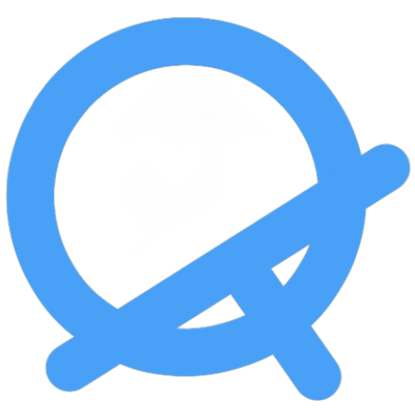
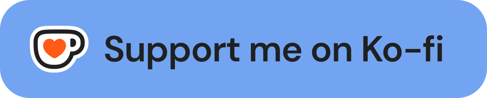
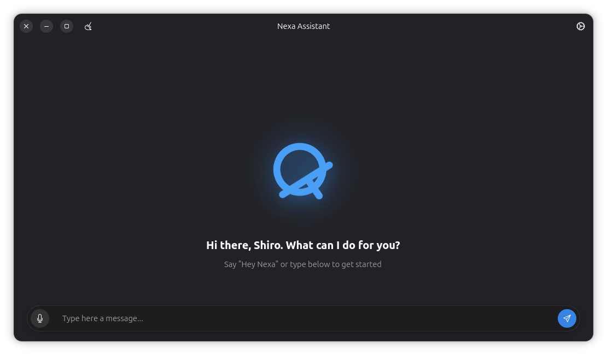
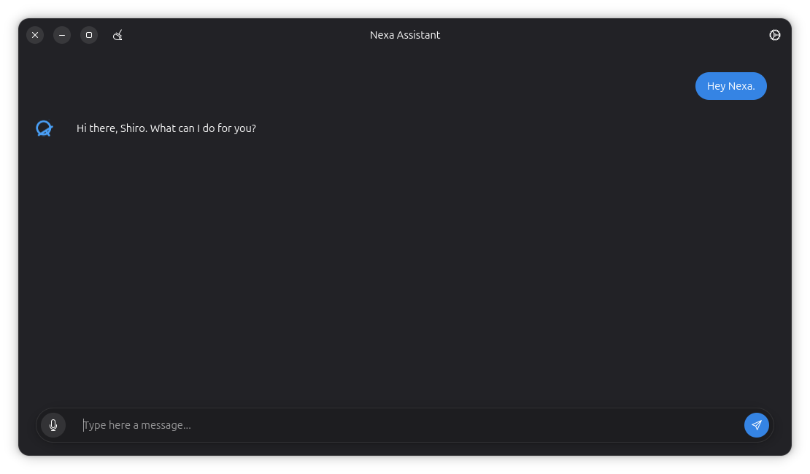
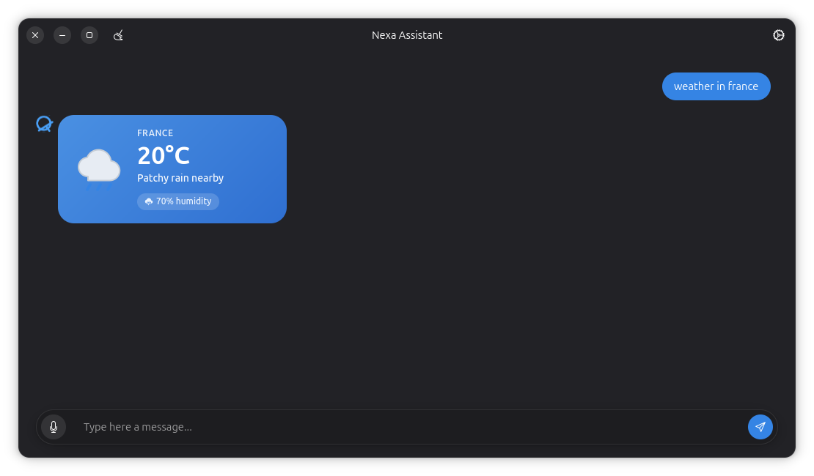

<p align="center">
  
</p>

<h1 align="center">Nexa Assistant</h1>

<p align="center">
  A local-first, privacy-focused voice assistant for Linux — built with GTK4 &amp; Adwaita.
</p>

<p align="center">
  <a href="https://ko-fi.com/shiro_osl">
    
  </a>
</p>

---

## The story

In 2025 the idea just wouldn't leave me alone. I didn't really have anyone
around to talk it through with, so I ended up hashing it out with ChatGPT
instead. At some point the name "Nexa" popped into my head, and it stuck.

The logo happened almost by accident — I opened FlipaClip on my phone one
day and just started drawing random lines, and that turned into what you
see today.

In the summer of 2026, right after finishing the school year, I started
actually building Nexa. No wifi at home at the time, so it was all done
completely offline. Eventually my parents heard about the project and
decided to get a router installed.

Now summer's almost over and school's about to start again, so it felt
like the right moment to open this up, share what I've built so far, and
see what people think Nexa should become next.

## What is Nexa?

Nexa is a voice assistant that runs entirely on your machine. Wake-word
detection, speech-to-text, and text-to-speech all happen locally, and
nothing leaves your computer automatically. The one opt-in exception is
web search, which sends your query using your own API key — see
[Privacy & Data](#privacy--data) below for the full picture.

- **Wake word** — say "Hey Nexa" to activate, powered by openWakeWord
- **Speech-to-text** — Whisper.cpp running fully offline
- **Text-to-speech** — Piper, with a choice of voices
- **Command pill** — a small, fast popup you can type or speak into,
  triggered by a global hotkey, for quick commands without opening the
  full window
- **Nexa Studio** — build your own custom trigger → action commands,
  with import/export so you can back up or share your commands
- **App integrations** — other apps can register their own voice
  commands with Nexa over D-Bus
- **Conversational small talk** — ask Nexa personal questions like
  "where were you born?" or "do you sleep?"
- **Web search** — optional, opt-in, using your own API key; see
  [Privacy](#privacy--data) below
- **Everyday features** — weather, jokes, facts, riddles, media and
  system controls, background/tray mode, global hotkey, and more

<p align="center">
  
</p>

<p align="center">
  
  
</p>

## Installing

Nexa is packaged as a Flatpak. **Don't clone this repository to install
it** — just download and run `setup.sh`, which handles everything:
dependencies, the GNOME runtime, building, and installing.

```bash
curl -O https://raw.githubusercontent.com/ShiroOSL/nexa-linux/main/setup.sh
chmod +x setup.sh
./setup.sh
```

Running it again later lets you **update** or **uninstall** Nexa — it
detects whether Nexa is already installed and shows the right menu.

## Status

Nexa is tagged as beta — still under active development, not yet on
Flathub, and not fully stable yet. Expect rough edges. Bug reports,
feedback, and ideas for what to build next are all welcome.

## Privacy & Data

Nothing leaves your computer automatically. The one opt-in exception is
web search, which uses your own API key and sends only your query.

Nexa can optionally save short "Hey Nexa" wake word clips on your
device to help improve the wake word model. This is off by default,
stays local unless you choose to export and email it to me, and I
delete anything sent to me once training is done — I don't sell it,
share it, or use it for anything else. See
[docs/TRAINING_DATA.md](docs/TRAINING_DATA.md) for the full explanation.

## License

The application code in this repository is licensed under
[GPL-3.0](LICENSE).

The "Nexa" name and logo are protected as trademarks — see
[TRADEMARKS.md](TRADEMARKS.md).

Nexa also bundles or downloads several third-party models and
components (Whisper, Piper voices, openWakeWord) under their own
original licenses — see [THIRD-PARTY-NOTICES.md](THIRD-PARTY-NOTICES.md).

## Support

If Nexa's been useful to you, consider supporting development on
[Ko-fi](https://ko-fi.com/shiro_osl) — it genuinely helps keep this going.
